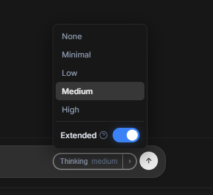

# VibeChatting — Native LLM Chat Interface

VibeChatting is a modern AI chat application focused on aesthetics, performance, and advanced functionality.

## Key Advantages
- **Premium Interface:** A stunning design featuring glassmorphism, smooth animations, and a deep, harmonious dark mode.

## AI Features
- **Core Chat:** Advanced interface with real-time streaming and a dedicated "Thinking" mode visualization.
- **Reasoning Support:** Reasoning is now fully supported thanks to the new Kobold.cpp update including the Reasoning effort feature.

  
- **Interactive Game Mode:** A choices-driven interactive text-adventure game engine where the AI guides the scene dynamically in real-time, showing streamed stats, choices, extra actions, and game session history.
- **GenAI Panel & Active Skills:** A universal in-app assistant with deep tool access that manages settings, writes messages (vibe mode), manipulates characters and groups, queries your memories, and executes game actions. Supports modular **GenAI Skills** (custom tools in `.json` or `.txt` formats) with a customizable active skills menu and library.
- **Web Search & Browsing:** GenAI has full internet access (Web Search function), enabling it to search the web in real time and browse websites to retrieve up-to-date information. Supports multiple search providers (including local SearXNG instances or Tavily API) with smart layout boilerplate removal and auto-approval capabilities.
- **Smart Image Generation with Anima:** Advanced integration with Anima for smart, context-aware image generation. Dynamically generates high-quality characters, locations, and scene illustrations directly aligned with the current chat context.
- **Character Creation:** Highly flexible system for defining personalities, scenarios, and greetings (including Alternate Greetings support and basically all cards compatible with SillyTavern format).
- **Message Translation:** Seamless bidirectional real-time translation:
  - **Input:** Automatic translation of your messages before sending.
  - **Output:** AI response translation to your native language while preserving original context.
- **AI Commenter:** Get situational analysis or creative (and funny) comments from a secondary AI agent.
- **AI Suggester:** Dynamic generation of suggestions for next replies or story continuation.

## Web Search & Private SearXNG Setup

VibeChatting supports advanced web search capability, allowing the AI to browse the internet in real time. For maximum privacy, stability, and speed, you can configure your own private SearXNG search engine instance.

### Features
- **Multiple Search Providers:** Supports DuckDuckGo (built-in HTML scraper), Tavily Search API, Custom SearXNG instance, or public SearXNG nodes (with auto-rotation and automatic DuckDuckGo fallback).
- **Auto-approve Web Requests:** Allows the AI to autonomously search and fetch pages in a recursive loop (great for Extended Thinking mode) without prompting you for confirmation.
- **Smart Web Page Cleaning:** Strips sidebars, footers, scripts, and navigation menus from downloaded websites, delivering clean, token-efficient text context directly to the model.
- **Targeted Search (`site:`):** The AI is instructed to use search operators (like `site:wikipedia.org query`) for precise target searches.

### Setup Guide for Local SearXNG (Docker)

To run a fast, private, and unlimited search engine on your local machine:

1. **Write Docker Configuration:** Create a folder for the Docker setup (e.g., `D:\other\docker`) containing the following `docker-compose.yml` file:
   ```yaml
   version: '3.7'
   services:
     searxng:
       container_name: searxng
       image: docker.io/searxng/searxng:latest
       ports:
         - "8080:8080"
       volumes:
         - ./searxng:/etc/searxng:rw
       environment:
         - SEARXNG_SETTINGS_PATH=/etc/searxng/settings.yml
       restart: always
   ```

2. **Configure SearXNG:** Inside the `searxng` sub-directory, create `settings.yml`:
   ```yaml
   use_default_settings: true
   server:
     port: 8080
     bind_address: "0.0.0.0"
     secret_key: "YOUR_UNIQUE_SECRET_KEY"
     image_proxy: true
   search:
     safe_search: 0
     formats:
       - html
       - json # Required for the API
   ```

3. **Start the service:** Open your terminal in the docker setup folder and run:
   ```bash
   docker compose up -d
   ```

4. **Link to VibeChatting:**
   - In VibeChatting, open **Settings** (Gear icon) -> **GenAI** -> **Web Search Settings**.
   - Select **SearXNG (Custom URL)** as the Search Provider.
   - Enter `http://localhost:8080` as the URL and close.

## Future Roadmap
- **Book Authoring:** An automated agent system to write, review, and structure entire novels or books interactively.
- **Advanced Animations:** I'll improve the streaming animations soon.

## System Requirements
- **Supported Models:**
  - **Fully Supported:** Gemma 4 31B (RP fine-tune recommended), Gemma 4 26B
  - **Partially Supported:** GLM 4.7 flash
- **Performance:** Generation speed of at least **20 tokens per second**.
